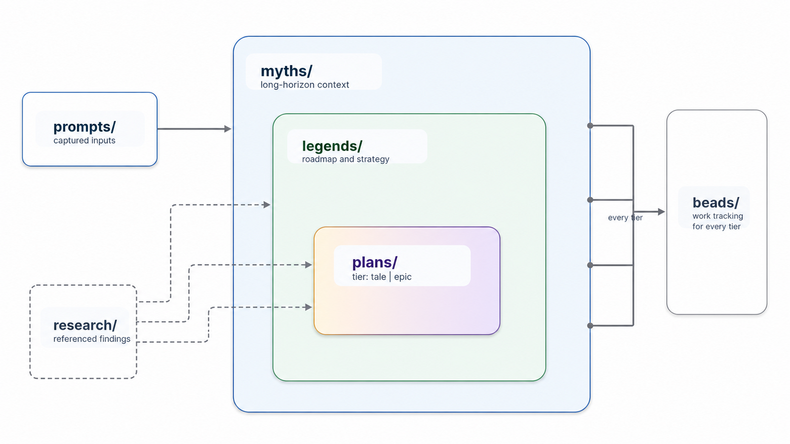

# Structured Development Docs

This SDD root keeps durable planning context close to the code it describes. It stores prompts, approved plans, roadmap
material, and bead state in predictable paths so humans and agents can reference the same artifacts over time. The root
may be the checkout's `sdd/` directory or a separate `.sase/sdd/` store; run `sase sdd path` or read `SASE_SDD_DIR` from
agent environments to locate it.

## Directory Layout

- `plans/` stores implementation plans. Each `plans/<YYYYMM>/prompts/` subdirectory stores the original user prompts or
  expanded prompt snapshots that led to that month's plans. Plan files require `tier: tale` for focused task plans or
  `tier: epic` for larger multi-phase plans.
- `research/` stores exploratory findings, prior art, options, critiques, and recommendations that inform later work.
- `beads/` stores bead issue data for SDD-backed work tracking.

Prompt, plan, and research files are normally organized under a `YYYYMM/` month directory relative to this root. For
example, a prompt at `plans/202605/prompts/example.md` pairs with `plans/202605/example.md`, while research lives at
`research/202605/example.md`. Prompt files should link to their generated plan-like artifact with frontmatter such as
`plan: plans/202605/example.md`; the plan-like artifact should link back with
`prompt: plans/202605/prompts/example.md`.

## Commands

- `sase sdd list` lists SDD markdown artifacts.
- `sase sdd path` prints the effective SDD root; pass a kind such as `research` to print that child directory.
- `sase sdd validate` checks frontmatter links between prompts and plan-like artifacts.
- `sase sdd repair-links` infers and repairs missing bidirectional links.
- `sase plan search` searches these `sdd/` plans and the machine-local `~/.sase/plans/` archive by content.
- `sase bead` manages SDD bead issues and epic work.

## Compatibility

The canonical top-level directories are `plans/`, `research/`, and `beads/`. Prompt snapshots live under
`plans/<YYYYMM>/prompts/`. Historical top-level `prompts/` and `specs/` aliases remain readable during migration, but
new snapshots are written only to the nested layout.
